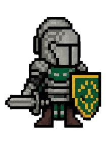
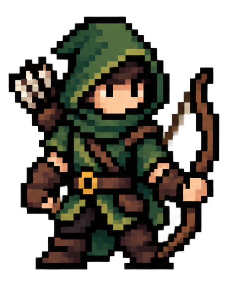

# New RPG

Um RPG de aventura por turnos, jogado no terminal, escrito em **Java**. O jogador escolhe uma classe de herói, distribui atributos, explora regiões perigosas, compra itens numa loja e enfrenta inimigos em batalhas por turnos — tudo com trilha sonora e efeitos.

> Projeto acadêmico desenvolvido em **2024**, durante o curso de **Software Developer** no **CESAE**.

---

## 📜 A História

Em um reino distante, um jovem guerreiro, conhecido por sua bravura e habilidade em combate, é convocado pelo **Rei Tobias** para uma missão vital: uma horda de criaturas sombrias invadiu a região do **norte**, ameaçando a paz do reino.

Com determinação inabalável, o herói parte em uma jornada perigosa — atravessando florestas densas, cavernas isoladas, lagos nebulosos e montanhas íngremes — enfrentando bestas cada vez mais poderosas. A jornada culmina na temida **Fortaleza Sombria**, onde o **General das Sombras** aguarda para o confronto final entre a luz e a escuridão.

---

## ⚔️ Os Heróis

Escolha entre três classes, cada uma com seu próprio estilo de combate:

<table>
  <tr>
    <td align="center"><br><b>Cavaleiro</b></td>
    <td align="center"><br><b>Arqueiro</b></td>
    <td align="center"><br><b>Feiticeiro</b></td>
  </tr>
  <tr>
    <td align="center">Resistente e brutal.<br>Ataca depois, mas bate forte.</td>
    <td align="center">Ágil e certeiro.<br>Ataca primeiro, alta chance de crítico.</td>
    <td align="center">Poder arcano.<br>Golpes devastadores à distância.</td>
  </tr>
</table>

---

## 🎮 Como jogar (recrutadores / testadores)

Não é preciso instalar Java nem nenhum programa — o executável já traz o runtime incluído.

1. Baixe o pacote na aba **[Releases](../../releases/latest)** deste repositório (arquivo `JogoRPG.zip`).
2. **Extraia** o `.zip` para uma pasta.
3. Dê dois cliques em **`Jogar.bat`**.

> Windows. O jogo abre numa janela de terminal e é controlado pelo teclado (digite o número da opção e pressione Enter).

---

## 🛠️ Rodar a partir do código-fonte

Requer o **JDK 17+** instalado.

```bash
# a partir da raiz do projeto
javac -encoding UTF-8 -d out -sourcepath src src/New_RPG/View/Main.java
java -cp out New_RPG.View.Main
```

> É necessário executar com a pasta `Ficheiros/` no diretório de trabalho (ela contém `itens.csv` e os áudios `.wav`).

---

## 🧩 Estrutura do projeto

```
src/New_RPG/
  Controller/   Estratégias de ataque (Cavaleiro, Arqueiro, Feiticeiro) e loja
  Domain/       Entidades (Herói, NPC, Vendedor) e Itens
  Jogo/         Fluxo do jogo e das salas
  Repository/   Leitura dos itens
  Tools/        Áudio e leitor de CSV
  View/         Ponto de entrada (Main)
Ficheiros/      Dados (itens.csv) e sons (.wav)
assets/         Imagens do README
```

Conceitos aplicados: Programação Orientada a Objetos (herança, polimorfismo, interfaces), o padrão **Strategy** (estratégias de ataque por classe), leitura de ficheiros CSV e reprodução de áudio com `javax.sound.sampled`.

---

## ⚠️ Aviso Legal

Este software foi criado **exclusivamente para fins educativos**, como parte do curso de **Software Developer** do **CESAE (2024)**.

- Uso permitido apenas no contexto acadêmico do curso.
- **É proibida a comercialização** deste software, no todo ou em parte.
- Todos os direitos reservados ao autor.
